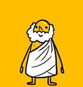

一直在坚持上本科生的《数据新闻》课程。然而对数据新闻的热情逐渐消减，理想却远远没有实现。存在的问题：数据新闻本身的内容混杂。课程内容涉及到**新闻选题、数据获取、统计分析、可视化设计**四个方面。每一个阶段都会消耗大量时间，有限的课堂授课无法解决这些问题。

- 一方面，如果学生缺乏选题经验和问题意识，可能会耗费整整一学期在选题方面。学生或者可能会为了增强选题的可控性，而选择自己熟悉的选题内容。
- 另一方面，数据也会成为选题的瓶颈。学生虽然选择了重要的社会问题，却最终发现因为无法获取数据而功亏一篑。

因而，这门课应该作为一门高阶的动手类型课程。也就是说，当学生已经掌握数据新闻的基础知识之后再来选修这门课。因此应该将这门课设置为研究生的高年级课程。**问题**：是否有可能针对本科生开设这门课程呢？

我想解决方法在于重新定位这门课程。数据新闻的特点类似深度报道，因而存在很多经典的案例，从案例当中学习可以让学生和老师摆脱来自选题和数据的限制。经过思考之后，我将这门课重新定义为 *计算新闻（Computational Journalism）*，在课程内容中突出经典的数据新闻案例的学习。

- 不要定位太高：这是本科生课程。学生没有基础、课程很多、时间有限、心理脆弱。
- 放弃功利的短期出成果模式：这会让学生和老师都很累，应该找到这个课程的授课节奏，不要将课程编程项目展示。
- 突出讨论和动手实践：要**切实留出一半的时间给学生**讨论和动手操作！
- 围绕师生的共同兴趣：与案例、实践、数据、研究相结合。
- 回归经典案例：通过汇总、鉴赏、分析和复制[经典案例](https://github.com/data-journalism/data-journalism.github.io/discussions/)进行学习。
- 突出师生的竞争优势：例如，我会在讲解环节更加强调计算（例如数据、统计、机器学习）和编程，让学生通过经典案例来感受高水平的可视化叙事。

参与讨论：[https://github.com/data-journalism/data-journalism.github.io/discussions/1](https://github.com/data-journalism/data-journalism.github.io/discussions/1)

